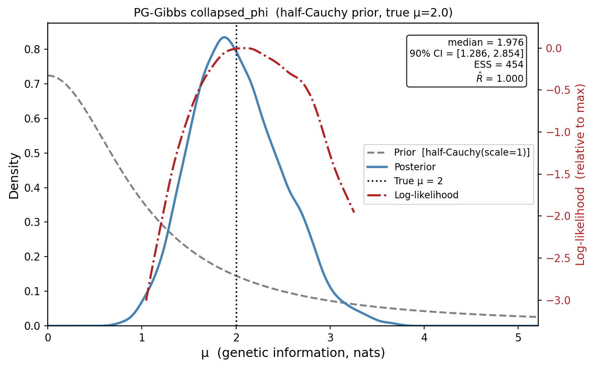
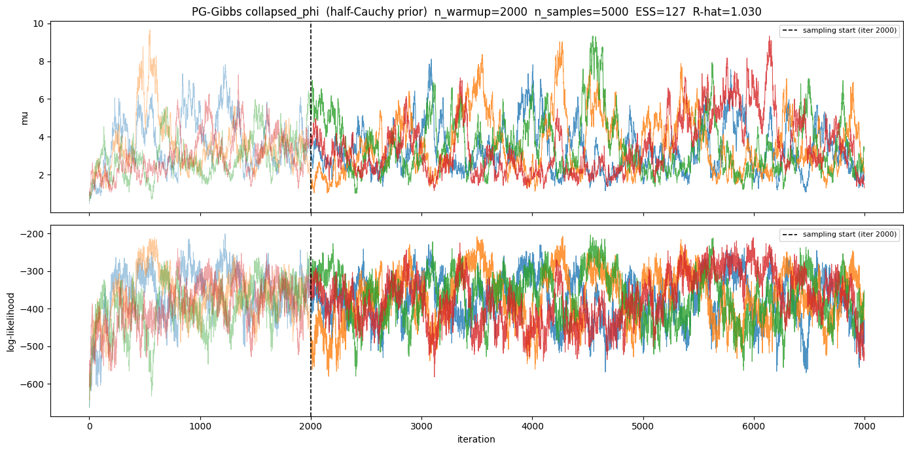
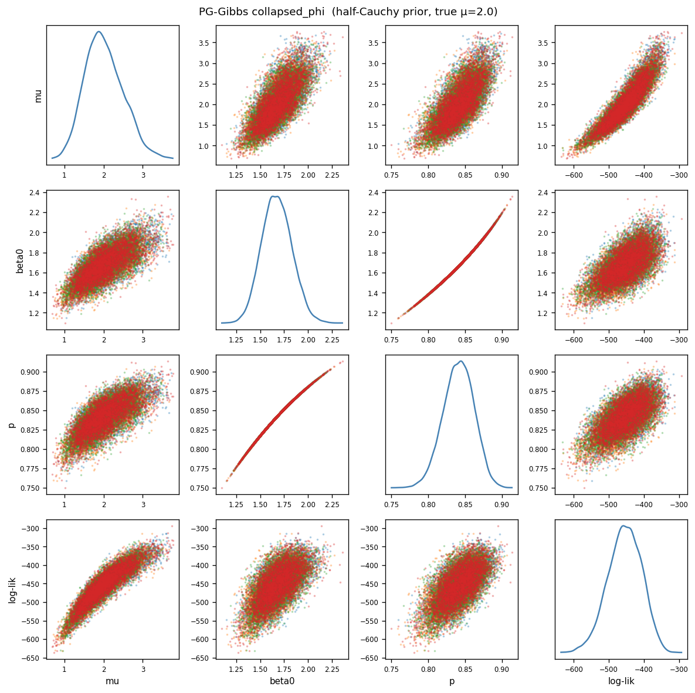
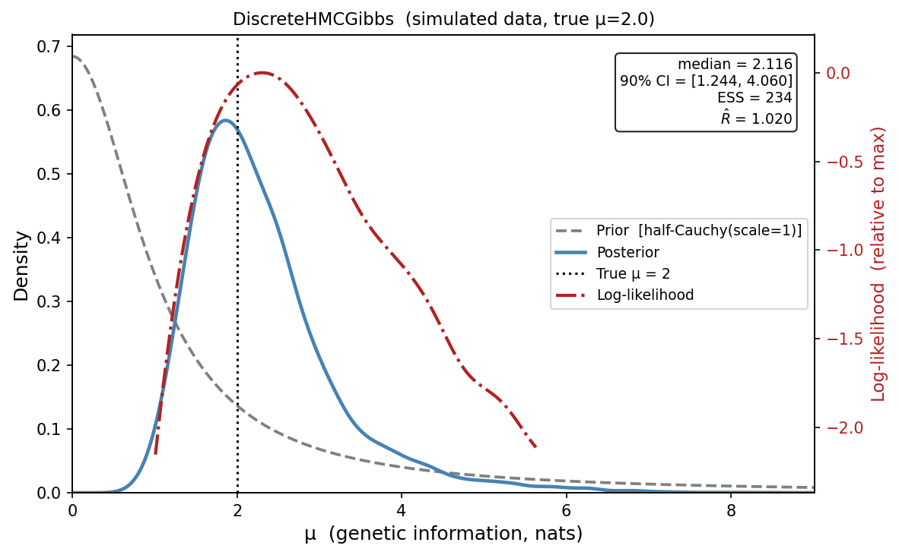
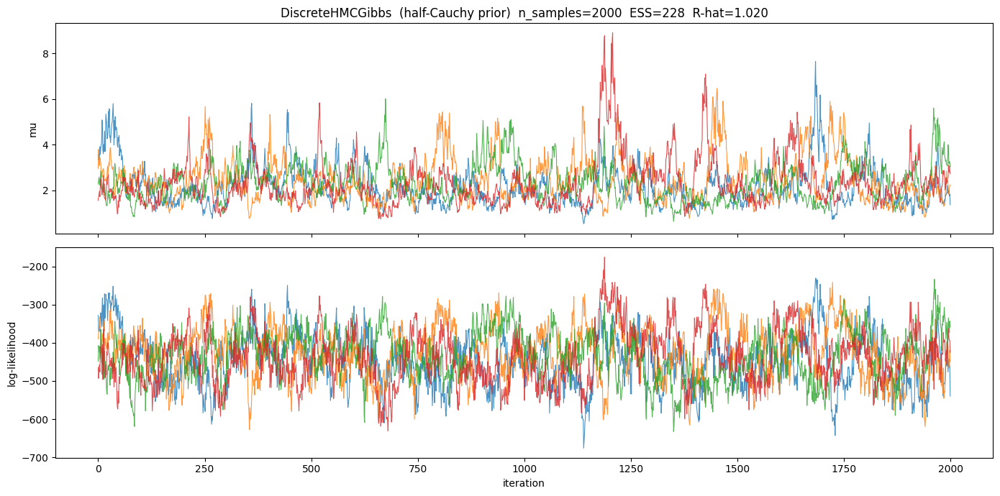
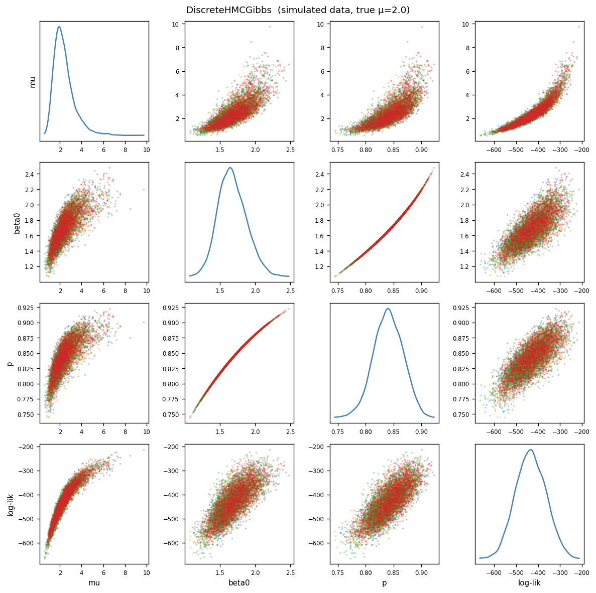

# geneticinfo

Bayesian inference of **genetic information for discrimination** from binary (case/control) traits.

The key quantity being estimated is Λ (lambda) — the expected log-likelihood ratio (in nats) favouring case over non-case status, given an individual's genetic risk (McKeigue, 2019). This gives the maximum expected information for discrimination that could be obtained from a polygenic risk score.  If the class-conditional distribution of the log-likelihood ratio favouring case over control status in controls is Gaussian with mean -Λ, the distribution in cases is also Gaussian with mean Λ, and both distributions have variance 2Λ. If the disease is rare (risk < 1%) and Λ is not very large (< 1 natural log unit), Λ = log(λ<sub>S</sub>) where λ<sub>S</sub> is the sibling recurrence risk ratio (Clayton, 2009).

## Models

All models share the structure: observed binary outcome y is Bernoulli with logits = β₀ + G, where G = L @ Z incorporates genetic correlation via the Cholesky factor L of the genetic relationship matrix.

- **`logistic_mvnorm`** — Gaussian random effects: z ~ Normal(0,1), G = s (L @ z). This model would be appropriate where sampling is based on a total population, rather than a case-control sample.
- **`logistic_mix2_mvnorm`** — Two-component mixture random effects using `MixtureSameFamily`, with the constraint μ = 0.5 s².
- **`lr_discrete`** — Same mixture model with explicit discrete latent class indicators, for use with `DiscreteHMCGibbs`.
- **`lr_discrete_blockdiag`** — Block-diagonal variant of `lr_discrete` that operates on batched per-family Cholesky factors after removing singletons.  Accepts mixed block sizes (pairs, triplets, …) via `L_list`, `y_list`, `sizes` arguments.

---

## `geneticinfo` module — Python API for PG-Gibbs inference

`geneticinfo.py` exposes the PG-Gibbs sampler as a clean Python module with three public functions.

### `build_blocks`

Detects the block structure of the genetic relationship matrix and reports a summary.  Call this before `sample_posterior()` to inspect the decomposition and choose `corr_threshold` before committing to a long MCMC run.  The returned dict can be passed directly to `sample_posterior()` to avoid rebuilding.

```python
blocks = build_blocks(
    L,                      # (M, M) lower-triangular Cholesky factor
    y,                      # (M,) binary case/control array (0 or 1)
    *,
    corr_threshold=0.0,     # absolute correlation threshold (see below)
)
```

Prints a one-line summary, for example:
```
Block structure: M=29522  n_blocks=1044  largest=3  relatives(size≥2)=1374
  size-1: 830  size-2: 672  size-3: 10
```

#### Choosing `corr_threshold`

By default (`corr_threshold=0.0`) only exact zeros in L are used to separate families, which is correct when L is exactly block-diagonal (e.g. a GRM built from known pedigree structure).

Real GRMs estimated from genotype data contain small off-diagonal elements between nominally unrelated individuals due to distant kinship and population structure.  Setting a small positive threshold ignores these weak correlations and produces a finer block decomposition:

```python
# Treat pairs with |A[i,j]| ≤ 0.05 as unrelated
blocks = build_blocks(L, y, corr_threshold=0.05)
```

When `corr_threshold > 0`, `build_blocks` computes `A = L @ L.T` and finds connected components of the thresholded adjacency graph using `scipy.sparse.csgraph.connected_components`.  This requires O(M²) additional memory.

### `sample_posterior`

```python
result = sample_posterior(
    L,                        # (M, M) lower-triangular Cholesky factor
    y,                        # (M,) binary case/control array (0 or 1)
    *,
    blocks=None,              # pre-built dict from build_blocks() (recommended)
    n_chains=4,
    n_warmup=1000,
    n_samples=5000,
    mu_prior_scale=1.0,       # half-Student-t scale on μ
    mu_prior_df=10.0,         # degrees of freedom (df=1 → half-Cauchy)
    p_prior_conc=20.0,        # Beta(K·p_obs, K·(1−p_obs)) concentration
    seed=0,
    progress_bar=True,        # per-chain tqdm bars
    corr_threshold=0.0,       # used only when blocks=None
    use_collapsed_phi=True,   # jointly collapsed μ and φ update (default)
)
```

Builds the `GroupedBlocks` representation (or uses pre-built `blocks`), prints block statistics, and runs `LRDiscreteBlockdiagPGGibbs` chains in parallel via `multiprocessing.Pool`.  Per-chain progress bars show warmup/sample phase and current μ.

The returned dict contains:

| Key | Content |
|---|---|
| `mu_chains` | `ndarray` (n_chains, n_samples) — per-chain μ samples |
| `mu_all` | `ndarray` (n_chains × n_samples,) — all samples pooled |
| `chain_dicts` | list of per-chain dicts (mu, beta0, p, ll, chain_id) |
| `block_info` | dict with M, n_blocks, sizes_summary, corr_threshold |
| `cfg` | `ChainConfig` used |
| `mu_prior_scale` | float |

### `summarize_and_plot`

```python
stats = summarize_and_plot(
    result,
    *,
    mu_true=None,    # optional true value; drawn as a vertical line
    title=None,
    outfile=None,    # path to save figure; if None, calls plt.show()
    prior_scale=None,
)
```

Prints mean, median, sd, 90% CI, ESS_bulk, and R-hat, then produces a figure with three curves:

- **Prior** — half-Student-t(μ_prior_scale, μ_prior_df), dashed gray
- **Posterior** — KDE of μ samples, solid blue
- **Likelihood** — importance-weighted KDE (posterior / prior), normalised, dot-dash red

Returns a dict with keys `mean`, `median`, `sd`, `ci90_lo`, `ci90_hi`, `ess_bulk`, `r_hat`.

### `plot_trace` and `plot_pairs`

```python
plot_trace(result, outfile=None, title="")
plot_pairs(result, outfile=None, title="")
```

`plot_trace` shows warmup and sampling iterations for μ and log-likelihood (one line per chain, warmup at α=0.4, sampling at α=0.8, vertical dashed line at the warmup boundary).  Annotates per-chain ESS and R̂.

`plot_pairs` shows a scatter matrix of the three global parameters (μ, p, log-likelihood) from the sampling period: KDE on the diagonal, scatter coloured by chain off-diagonal.  β₀ = logit(p) is omitted as it carries no information beyond p.

### Example

```python
import numpy as np
from geneticinfo import build_blocks, sample_posterior, summarize_and_plot, plot_trace, plot_pairs
from geneticinfo_functions import simulate_casecontrol_related

y, A, L, info, g = simulate_casecontrol_related(
    n_fullsib_pairs=400_000, n_fullsib_trips=200_000,
    n_halfsib_pairs=40_000, n_unrelated=4_000,
    K=0.01, mu=2.0, seed=42, return_genotypic_values=True,
)
L_np, y_np = np.asarray(L), np.asarray(y)

# Inspect block structure first; adjust corr_threshold if needed
blocks = build_blocks(L_np, y_np, corr_threshold=0.05)

result = sample_posterior(
    L_np, y_np, blocks=blocks,
    n_chains=4, n_warmup=1000, n_samples=5000,
)

summarize_and_plot(result, mu_true=2.0, outfile="posterior.png")
plot_trace(result, outfile="trace.png")
plot_pairs(result, outfile="pairs.png")
```

---

## Sampling algorithm: Pólya-gamma Gibbs sampler (NumPy / CPU)

### Overview

A CPU-based Gibbs sampler is implemented in `pg_gibbs_clean.py` using the Pólya-gamma (PG) data-augmentation scheme of Polson, Scott and Windle (2013).  The class `LRDiscreteBlockdiagPGGibbs` targets exactly the same model as `lr_discrete_blockdiag`.  Introducing per-individual auxiliary variables ω_i ~ PG(1, |η_i|) renders the logistic likelihood conditionally Gaussian, enabling exact block Gibbs updates for the continuous latents.

### Model

The logistic mixed model with two-component mixture random effects is:

- **Outcome**: y_i | η_i ~ Bernoulli(σ(η_i))
- **Linear predictor**: η_i = φ + (L @ Z_mix)_i − μ·m̄·v_i,  where v = L @ **1** and m̄ = tanh(φ/2)
- **Mixture prior**: Z_mix_i | r_i, μ ~ Normal(μ r_i, 2μ),  r_i ∈ {−1, +1}
- **Class probability**: r_i = +1 with probability p = σ(φ),  φ = logit(p)
- **Priors**: μ ~ half-Student-t(df, scale),  p ~ Beta(K·p_obs, K·(1−p_obs))

The model enforces the constraint μ = 0.5 s², so Λ = μ is both the mean of the class-conditional log-LR distributions and half their variance.

### Gibbs steps

Each step cycles over five updates, building a single eigendecomposition per block that is reused for both the φ and μ slices:

**1. ω | η** — Resample Pólya-gamma auxiliaries: ω_i ~ PG(1, η_i).

**2. Z_mix | ω, y, φ, μ, r** — Exact Gaussian draw per block (analytic Cholesky; size-2 blocks fully vectorised).

**3. r | Z_mix, φ** — Exact Bernoulli: p(r_i = +1) = σ(Z_mix_i + φ).

**4 & 5. φ and μ jointly collapsed over Z_mix** — The key innovation: rather than sampling φ and μ from 1D conditionals that hold Z_mix fixed (which traverses the correlated (μ, φ) posterior slowly), both slices integrate out Z_mix analytically.

The PG-augmented likelihood and Gaussian prior on Z_mix jointly define a Gaussian in Z_mix.  Completing the square and integrating out Z_mix, the eigendecomposition of K = L^T diag(ω) L (computed once per block per step) supports both marginal posteriors:

**Collapsed φ update** — With μ fixed and Z_mix integrated out:

```
h(φ) = A − φ·B + μ·tanh(φ/2)·p1   (eigenbasis)

log p(φ | ω, r, y) = (offset terms in φ)
                   + ½ Σ_j h_j(φ)² / (λ_j + τ)   ← collapsed quadratic
                   + log p(φ)                       ← Beta + r likelihood + Jacobian
```

where A = U^T(L^T κ + ½r), B = U^T(L^T ω), p1 = U^T(L^T(ω⊙v)) are phi-independent projections onto the eigenvectors U, and τ = 1/(2μ).

**Collapsed μ update** — With φ updated and Z_mix integrated out:

```
log p(θ | ω, r, φ, y) = log p(θ)
  − ½ M log(2μ) − ¼ M μ                               ← Z_mix normalisation
  + (offset terms in μ)
  + ½ Σ_j [p0_j + μ·mbar·p1_j]² / (λ_j + τ)          ← collapsed quadratic
  − ½ Σ_j log(λ_j + τ)                                 ← log-det
```

where θ = log μ, p0_j = A_j − φ·B_j (updated after the φ slice), and the same eigenvalues λ_j are reused.

Slice sampling is used for both φ and μ (one eigendecomposition per block per Gibbs step, shared between the two slices).

**6. Z_mix refreshed** under the new μ.

### Why collapsed updates improve mixing

The uncollapsed sampler holds Z_mix fixed while sampling φ and μ, inducing a posterior ridge with Corr(μ, φ) ≈ 0.73.  Sampling each parameter along its 1D conditional traverses this ridge slowly (lag-1 autocorrelation ≈ 0.95, IACT ≈ 37).  The collapsed sampler integrates Z_mix out before each φ and μ slice, breaking the (μ, φ, Z_mix) dependence and widening the conditional distributions, improving ESS by ~40% at no additional computational cost (the eigendecomposition is computed once and shared).

### Running the example

```bash
python run_comparison.py
```

Simulates a large case-control dataset with full-sib pairs, triplets, and half-sib pairs; builds the block structure; reduces the dataset to relatives only (unrelated singletons contribute no information about λ_S and are discarded); then runs PG-Gibbs with and without ASIS and prints a side-by-side comparison with trace and pairs plots per condition.

---

## Comparison on the same dataset

**Simulated population** (seed = 42)

```
Total individuals:        1,484,000
  Full-sib pairs:           400,000   (genetic correlation 0.5)
  Full-sib triplets:        200,000   (genetic correlation 0.5)
  Half-sib pairs:            40,000   (genetic correlation 0.25)
  Unrelated:                  4,000
Prevalence K = 0.01,  true μ = 2.0  (λ_S = exp(μ) ≈ 7.39)
```

**Case-control sample**

```
M = 29,522  (14,761 cases, 14,761 controls)
Related individuals (block size ≥ 2):  M_rel = 1,374
  Blocks: 672 pairs + 10 triplets
```

Both samplers operate on M_rel = 1,374 relatives only.

**Results (true μ = 2.0, both samplers use half-Cauchy(scale=1) prior)**

```
Algorithm                  median    sd      90% CI          ESS   ESS/s   R-hat   wall     hardware
PG-Gibbs (collapsed_phi)    1.976  0.484  [1.286, 2.854]    454    3.50   1.000    130 s   CPU, 4 cores
DiscreteHMCGibbs            2.108  0.851  [1.233, 3.803]    261    0.37   1.010    707 s   GPU, 4× V100
```

PG-Gibbs achieves **9× higher ESS per second** than DiscreteHMCGibbs, using only CPU.  Both 90% CIs contain the true value.  The PG-Gibbs posterior is narrower (sd 0.48 vs 0.85) because the scale-mixture auxiliary variable plus JAGS step-width adaptation concentrates sampling near the posterior mode, while NUTS explores the heavier tails of the half-Cauchy prior more freely.

Run `python run_hmc_comparison.py` to reproduce (requires 4 GPUs for the DiscreteHMCGibbs section).

**Algorithm comparison**

| Feature | PG-Gibbs (collapsed_phi) | DiscreteHMCGibbs |
|---|---|---|
| Framework | NumPy (pure CPU) | NumPyro / JAX |
| Hardware | CPU (4 cores) | GPU (4 × Tesla V100) |
| Individuals used | M_rel only | M_rel only |
| Mixed block sizes | Yes (pairs, triplets, …) | Yes |
| Discrete r_i update | Exact Bernoulli given Z_mix | Exact enumeration (config_enumerate) |
| μ update | Slice on collapsed log p(μ \| ω, r, φ, y) with scale-mixture auxiliary | NUTS (joint with φ, Z) |
| φ update | Slice on collapsed log p(φ \| ω, r, y) | NUTS (joint with μ, Z) |
| μ prior | half-Cauchy(scale=1) via HalfNormal scale mixture | half-Cauchy(scale=1) |
| φ prior | Beta(20·p_obs, 20·(1−p_obs)) | same |
| Chains × samples | 4 × 5,000 | 4 × 2,000 |
| ESS (bulk, μ) | 454 | 261 |
| ESS per sample | 2.3 % | 3.3 % |
| ESS per second | 3.50 | 0.37 |
| Wall time | 130 s | 707 s |

### PG-Gibbs (collapsed_phi, half-Cauchy prior): prior, posterior and likelihood



Half-Cauchy(scale=1) prior (dashed gray), posterior KDE (solid blue), log-likelihood (dot-dash red, right axis). True μ = 2.0 shown as a vertical dashed line. Posterior median 1.976, 90% CI [1.286, 2.854].

### PG-Gibbs (collapsed_phi, half-Cauchy prior): trace plots



Warmup iterations at half opacity; vertical dashed line marks end of warmup. All four chains mix well (R-hat = 1.000).

### PG-Gibbs (collapsed_phi, half-Cauchy prior): pairs plots



Scatter matrix of μ, β₀, p, log-likelihood coloured by chain. The (μ, β₀) correlation is the posterior ridge that motivates the collapsed update.

### DiscreteHMCGibbs: prior, posterior and likelihood



Half-Cauchy(scale=1) prior (dashed gray), posterior KDE (solid blue), log-likelihood (dot-dash red, right axis). True μ = 2.0 shown as a vertical dashed line. Posterior median 2.108, 90% CI [1.233, 3.803]. The wider interval compared to PG-Gibbs reflects more thorough exploration of the heavy-tailed prior by NUTS.

### DiscreteHMCGibbs: trace plots



Sampling period only (warmup not collected). All four chains converge to the same region (R-hat = 1.010).

### DiscreteHMCGibbs: pairs plots



Scatter matrix of μ, β₀, p, log-likelihood coloured by chain. The (μ, β₀) correlation is visibly weaker than in PG-Gibbs because NUTS explores the correlated posterior jointly rather than via 1D slices.

---

## DiscreteHMCGibbs (NumPyro / JAX)

### Overview

The `lr_discrete_blockdiag` model is fitted with NumPyro's `DiscreteHMCGibbs` (modified=True, NUTS inner kernel). The class indicators r_i ∈ {−1, +1} are discrete latent variables; `DiscreteHMCGibbs` alternates between enumerating over these exactly and running NUTS for the continuous parameters (μ, s, β₀).

### Usage

```python
import jax
jax.config.update("jax_enable_x64", True)
import jax.numpy as jnp
import numpyro
from numpyro.infer import MCMC, NUTS, DiscreteHMCGibbs
from jax import random
from geneticinfo_functions import lr_discrete_blockdiag

numpyro.set_host_device_count(4)
inner_kernel = NUTS(lr_discrete_blockdiag, max_tree_depth=8)
kernel = DiscreteHMCGibbs(inner_kernel, modified=True)
mcmc = MCMC(kernel, num_warmup=1000, num_samples=2000,
            num_chains=4, chain_method="parallel")
mcmc.run(random.PRNGKey(0),
         L_list=hmc_L_list, y_list=hmc_y_list, sizes=hmc_sizes, p_obs=p_obs)
mcmc.print_summary()
```

See `run_hmc_comparison.py` for the full script including data preparation and plots.

---

## Files

| File | Description |
|---|---|
| `geneticinfo.py` | Public API: `build_blocks`, `sample_posterior`, `summarize_and_plot`, `plot_trace`, `plot_pairs` |
| `geneticinfo_functions.py` | NumPyro model definitions (`lr_discrete_blockdiag`), simulation (`simulate_casecontrol_related`) |
| `pg_gibbs_clean.py` | `LRDiscreteBlockdiagPGGibbs` sampler; `LRBlockdiagPGConfig`; `MuCollapsedCache`; `build_mu_collapsed_cache`; `logpost_theta_mu_collapsed` |
| `pg_gibbs_vectorized.py` | `GroupedBlocks` (block-by-size storage and mat-vec) |
| `polyagamma_gibbs.py` | Lower-level utilities: `slice_sample_1d`, `infer_blocks_from_L`, `BlockStructure` |
| `run_comparison.py` | Compare PG-Gibbs with and without ASIS on simulated data; save plots |
| `run_hmc_comparison.py` | Head-to-head comparison of PG-Gibbs and DiscreteHMCGibbs with identical half-Cauchy(scale=1) prior |

## References

- Clayton DG (2009). Prediction and interaction in complex disease genetics: experience in type 1 diabetes. *PLoS Genetics*, 5(7), e1000540.
- McKeigue PM (2019). Quantifying performance of a diagnostic test as the expected information for discrimination: relation to the C-statistic. *Statistical Methods in Medical Research*, 28(6), 1841–1851.
- Polson NG, Scott JG, Windle J (2013). Bayesian inference for logistic models using Pólya-gamma latent variables. *Journal of the American Statistical Association*, 108(504), 1339–1349.

## License

See [LICENSE](LICENSE).
