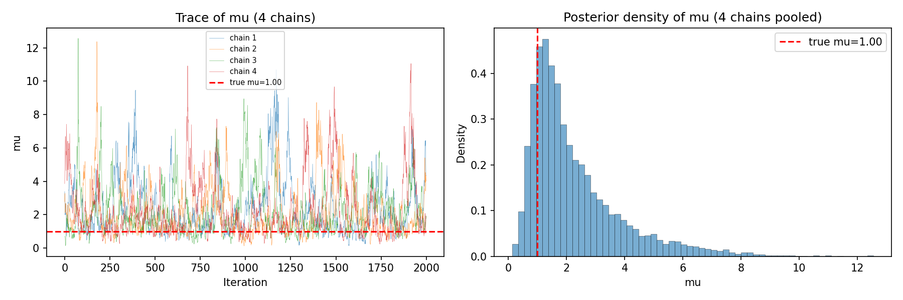

# geneticinfo

Bayesian inference of **genetic information for discrimination** from binary (case/control) traits.

The key quantity being estimated is Λ (lambda) — the expected log-likelihood ratio (in nats) favouring case over non-case status, given an individual's genetic risk (McKeigue, 2019). This gives the maximum expected information for discrimination that could be obtained from a polygenic risk score.  If the class-conditional distribution of the log-likelihood ratio favouring case over control status in controls is Gaussian with mean -Λ, the distribution in cases is also Gaussian with mean Λ, and both distributions have variance 2Λ. If the disease is rare (risk < 1%) and Λ is not very large (< 1 natural log unit), Λ = log(λ<sub>S</sub>) where λ<sub>S</sub> is the sibling recurrence risk ratio (Clayton, 2009).

## Models

All models share the structure: observed binary outcome y is Bernoulli with logits = β₀ + G, where G = L @ Z incorporates genetic correlation via the Cholesky factor L of the genetic relationship matrix.

- **`logistic_mvnorm`** — Gaussian random effects: z ~ Normal(0,1), G = s (L @ z). Default model for SVI fitting.
- **`logistic_mix2_mvnorm`** — Two-component mixture random effects using `MixtureSameFamily`, with the constraint μ = 0.5 s².
- **`lr_discrete`** — Same mixture model with explicit discrete latent class indicators, for use with `DiscreteHMCGibbs`.
- **`lr_discrete_blockdiag`** — Block-diagonal variant of `lr_discrete` that operates on batched per-family Cholesky factors after removing singletons, for efficient MCMC on large samples.

## Quick start

### Requirements

- JAX (with GPU support recommended)
- NumPyro
- NumPy, SciPy, matplotlib

Multi-GPU systems can run chains in parallel via `chain_method="parallel"`.

### Running the example

```bash
python test_discrete_gibbs_large.py
```

This simulates a case-control dataset with related individuals, reduces the genetic relationship matrix to relative-only blocks, fits `lr_discrete_blockdiag` with `DiscreteHMCGibbs`, and prints posterior summaries.

#### Simulated dataset

A population of 884,000 individuals is generated containing 400,000 full-sib pairs (genetic correlation 0.5), 40,000 half-sib pairs (correlation 0.25), and 4,000 unrelated individuals. Disease status follows a logistic model calibrated to prevalence K = 0.01 with genetic information μ = 1.0 nat. The case-control sample retains all cases and an equal number of controls.

```
=== Population ===
  Total individuals:          884,000
    Full-sib pairs:           400,000
    Half-sib pairs:            40,000
    Unrelated:                  4,000
  Cases in population:          8,963
  Observed prevalence:   0.010139  (target: 0.0100)
  Concordant-affected full-sib pairs: 77

=== Sibling recurrence risk ratio (λ_S) ===
  Theoretical exp(μ):   2.7183
  Empirical (full sibs): 1.8694
  Ratio empirical/theoretical: 0.6877

=== Case-control sample ===
  Sample size M:          17926
    Cases:                 8963
    Controls:              8963
  Full-sib pairs (both sampled):  199
    of which both affected:       77
  Half-sib pairs (both sampled):  15

=== True parameters ===
  μ       = 1.0000  (expected log-LR, nats)
  s        = 1.4142
  α        = -5.5465  (intercept)
  K        = 0.0100
```

#### Block-diagonal reduction

Most sampled individuals are singletons (no relatives in the sample) and do not contribute to estimation of genetic parameters. The preprocessing functions `find_blocks()` and `reduce_to_relatives()` identify connected components in the relationship matrix and discard singletons, reducing the problem size dramatically:

```
=== Block decomposition ===
  Original M:       17926
  Reduced M:        428
  Number of blocks: 214
  Block size:       2
  Reduction ratio:  0.024
```

The 17,926 x 17,926 relationship matrix is reduced to 214 independent 2 x 2 blocks (428 individuals in relative pairs). The per-block Cholesky factors are stored as a `(214, 2, 2)` array and the matmul is done via `jnp.einsum`, replacing the original O(M²) dense matmul.

#### MCMC with DiscreteHMCGibbs

`lr_discrete_blockdiag` is fitted with `DiscreteHMCGibbs` (modified=True, NUTS inner kernel, max_tree_depth=8). Four chains run in parallel on separate GPUs.



#### Posterior summary (4 chains, 2000 warmup + 2000 samples each)

```
                         mean       std    median      5.0%     95.0%     n_eff     r_hat
                 mu      2.25      1.58      1.75      0.37      4.54    207.30      1.00
                  p      0.63      0.04      0.63      0.57      0.70    939.44      1.01
                  s      2.01      0.67      1.87      1.00      3.09    204.63      1.00
```

True values: μ = 1.00, s = 1.41. The true μ is within the 90% credible interval [0.37, 4.54]. Wall time: ~2.5 minutes on 4 x Tesla V100-SXM2-32GB GPUs.

### Using the module directly

```python
import jax
jax.config.update("jax_enable_x64", True)
import jax.numpy as jnp
import numpyro
from numpyro.infer import MCMC, NUTS, DiscreteHMCGibbs
from jax import random

from geneticinfo import (
    simulate_casecontrol_related, print_casecontrol_summary,
    lr_discrete_blockdiag, reduce_to_relatives,
)

# Simulate data
y, A, L, info = simulate_casecontrol_related(
    n_fullsib_pairs=400_000, n_halfsib_pairs=40_000, n_unrelated=4000,
)

# Reduce to relatives only
y_red, A_red, L_red, kept_idx, block_sizes = reduce_to_relatives(A, y)
block_size = block_sizes[0]
n_blocks = len(block_sizes)

# Extract per-block Cholesky factors
import numpy as np
L_blocks = np.zeros((n_blocks, block_size, block_size))
offset = 0
for i in range(n_blocks):
    L_blocks[i] = L_red[offset:offset + block_size, offset:offset + block_size]
    offset += block_size

# Run MCMC
num_chains = min(4, jax.device_count())
numpyro.set_host_device_count(num_chains)

inner_kernel = NUTS(lr_discrete_blockdiag, max_tree_depth=8)
kernel = DiscreteHMCGibbs(inner_kernel, modified=True)
mcmc = MCMC(kernel, num_warmup=2000, num_samples=2000,
            num_chains=num_chains, chain_method="parallel")
mcmc.run(random.PRNGKey(0),
         L_blocks=jnp.array(L_blocks), y_flat=jnp.array(y_red, dtype=jnp.float64),
         n_blocks=n_blocks, block_size=block_size, p_obs=float(y.mean()))
mcmc.print_summary()
```

## Files

| File | Description |
|------|-------------|
| `geneticinfo.py` | Model definitions, block-diagonal preprocessing, SVI fitting, and simulation |
| `test_discrete_gibbs_large.py` | End-to-end example: simulate, reduce, fit with DiscreteHMCGibbs, plot |

## References

- Clayton DG (2009). Prediction and interaction in complex disease genetics: experience in type 1 diabetes. *PLoS Genetics*, 5(7), e1000540.
- McKeigue PM (2019). Quantifying performance of a diagnostic test as the expected information for discrimination: relation to the C-statistic. *Statistical Methods in Medical Research*, 28(6), 1841–1851.

## License

See [LICENSE](LICENSE).
