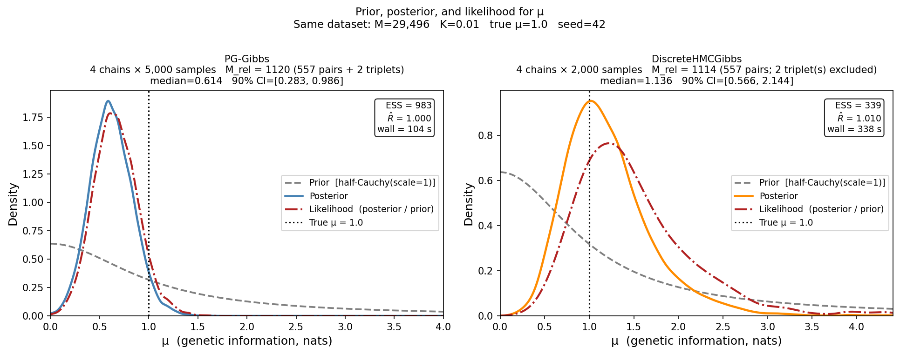

# geneticinfo

Bayesian inference of **genetic information for discrimination** from binary (case/control) traits.

The key quantity being estimated is Λ (lambda) — the expected log-likelihood ratio (in nats) favouring case over non-case status, given an individual's genetic risk (McKeigue, 2019). This gives the maximum expected information for discrimination that could be obtained from a polygenic risk score.  If the class-conditional distribution of the log-likelihood ratio favouring case over control status in controls is Gaussian with mean -Λ, the distribution in cases is also Gaussian with mean Λ, and both distributions have variance 2Λ. If the disease is rare (risk < 1%) and Λ is not very large (< 1 natural log unit), Λ = log(λ<sub>S</sub>) where λ<sub>S</sub> is the sibling recurrence risk ratio (Clayton, 2009).

## Models

All models share the structure: observed binary outcome y is Bernoulli with logits = β₀ + G, where G = L @ Z incorporates genetic correlation via the Cholesky factor L of the genetic relationship matrix.

- **`logistic_mvnorm`** — Gaussian random effects: z ~ Normal(0,1), G = s (L @ z). This model would be appropriate where sampling is based on a total population, rather than a case-control sample.
- **`logistic_mix2_mvnorm`** — Two-component mixture random effects using `MixtureSameFamily`, with the constraint μ = 0.5 s².
- **`lr_discrete`** — Same mixture model with explicit discrete latent class indicators, for use with `DiscreteHMCGibbs`.
- **`lr_discrete_blockdiag`** — Block-diagonal variant of `lr_discrete` that operates on batched per-family Cholesky factors after removing singletons.  Accepts mixed block sizes (pairs, triplets, …) via `L_list`, `y_list`, `sizes` arguments.

---

## Sampling algorithm 1: DiscreteHMCGibbs (NumPyro / JAX)

### Overview

The `lr_discrete_blockdiag` model is fitted with NumPyro's `DiscreteHMCGibbs` (modified=True, NUTS inner kernel). The class indicators r_i ∈ {−1, +1} are discrete latent variables; `DiscreteHMCGibbs` alternates between enumerating over these exactly and running NUTS for the continuous parameters (μ, s, β₀).

**Key preprocessing — reduction to relatives only.**  Unrelated individuals (singletons in the genetic relationship matrix) contribute no information about λ_S and are discarded before fitting. The functions `find_blocks()` and `reduce_to_relatives()` extract connected components, reducing the data from M to M_rel ≪ M.

### Running the example

```bash
python test_discrete_gibbs_large.py
```

#### Simulated dataset

A population of 884,000 individuals is generated containing 400,000 full-sib pairs (genetic correlation 0.5), 40,000 half-sib pairs (correlation 0.25), and 4,000 unrelated individuals. Disease status follows a logistic model calibrated to prevalence K = 0.01 with genetic information μ = 1.0 nat. The case-control sample retains all cases and an equal number of controls.

```
=== Population ===
  Total individuals:          884,000
    Full-sib pairs:           400,000
    Half-sib pairs:            40,000
    Unrelated:                  4,000
  Cases in population:          8,963
  Observed prevalence:   0.010139  (target: 0.0100)
  Concordant-affected full-sib pairs: 77

=== Sibling recurrence risk ratio (λ_S) ===
  Theoretical exp(μ):   2.7183
  Empirical (full sibs): 1.8694
  Ratio empirical/theoretical: 0.6877

=== Case-control sample ===
  Sample size M:          17926
    Cases:                 8963
    Controls:              8963
  Full-sib pairs (both sampled):  199
    of which both affected:       77
  Half-sib pairs (both sampled):  15

=== True parameters ===
  μ       = 1.0000  (expected log-LR, nats)
  s        = 1.4142
  α        = -5.5465  (intercept)
  K        = 0.0100
```

#### Block-diagonal reduction

```
=== Block decomposition ===
  Original M:       17926
  Reduced M:        428
  Number of blocks: 214
  Block size:       2
  Reduction ratio:  0.024
```

The 17,926 × 17,926 relationship matrix is reduced to 214 independent 2×2 blocks (428 individuals in relative pairs). The per-block Cholesky factors are stored as a `(214, 2, 2)` array and the matmul is done via `jnp.einsum`, replacing the original O(M²) dense matmul.

#### Posterior summary (4 chains, 2000 warmup + 2000 samples)

```
                     mean       std    median      5.0%     95.0%     n_eff     r_hat
             mu      2.25      1.58      1.75      0.37      4.54    207.30      1.00
              p      0.63      0.04      0.63      0.57      0.70    939.44      1.01
              s      2.01      0.67      1.87      1.00      3.09    204.63      1.00
```

True values: μ = 1.00, s = 1.41.  The true μ is within the 90% credible interval [0.37, 4.54].  Wall time: ~2.5 minutes on 4 × Tesla V100-SXM2-32GB GPUs.

### Usage

```python
import jax
jax.config.update("jax_enable_x64", True)
import jax.numpy as jnp
import numpyro
from numpyro.infer import MCMC, NUTS, DiscreteHMCGibbs
from jax import random
from geneticinfo import (
    simulate_casecontrol_related, print_casecontrol_summary,
    lr_discrete_blockdiag, reduce_to_relatives,
)

y, A, L, info = simulate_casecontrol_related(
    n_fullsib_pairs=400_000, n_halfsib_pairs=40_000, n_unrelated=4000,
)
y_red, A_red, L_red, kept_idx, block_sizes = reduce_to_relatives(A, y)
block_size = block_sizes[0]
n_blocks = len(block_sizes)

import numpy as np
L_blocks = np.zeros((n_blocks, block_size, block_size))
offset = 0
for i in range(n_blocks):
    L_blocks[i] = L_red[offset:offset + block_size, offset:offset + block_size]
    offset += block_size

numpyro.set_host_device_count(4)
inner_kernel = NUTS(lr_discrete_blockdiag, max_tree_depth=8)
kernel = DiscreteHMCGibbs(inner_kernel, modified=True)
mcmc = MCMC(kernel, num_warmup=2000, num_samples=2000,
            num_chains=4, chain_method="parallel")
mcmc.run(random.PRNGKey(0),
         L_blocks=jnp.array(L_blocks), y_flat=jnp.array(y_red, dtype=jnp.float64),
         n_blocks=n_blocks, block_size=block_size, p_obs=float(y.mean()))
mcmc.print_summary()
```

---

## Sampling algorithm 2: Pólya-gamma Gibbs sampler (NumPy / CPU)

### Overview

A CPU-based Gibbs sampler is implemented in `pg_gibbs_clean.py` using the Pólya-gamma (PG) data-augmentation scheme of Polson, Scott and Windle (2013).  The class `LRDiscreteBlockdiagPGGibbs` targets exactly the same model as `lr_discrete_blockdiag`.  Introducing per-individual auxiliary variables ω_i ~ PG(1, |η_i|) renders the logistic likelihood conditionally Gaussian, enabling exact block Gibbs updates for the continuous latents.

Each Gibbs step cycles over:

1. **ω | η** — resample Pólya-gamma auxiliaries.
2. **Z_mix | ω, y, φ, μ, r** — Gaussian draw per block (analytic Cholesky; size-2 blocks fully vectorised, no LAPACK calls).
3. **r | Z_mix, φ** — exact Bernoulli draw: p(r_i = +1) = σ(Z_mix_i + φ).
4. **φ | rest** — slice sampler on the PG-augmented log-posterior for φ = logit(p).
5. **μ | ω, r, φ, y** — slice sampler on the *collapsed* log-posterior p(μ | ω, r, φ, y), which integrates out Z_mix analytically via an eigendecomposition of L^T diag(ω) L per block:

```
log p(θ | ω, r, φ, y) = log p(θ)
  − ½ M log(2μ) − ¼ M μ                 ← Z_mix-prior normalisation
  + const(ω, φ)                          ← offset-only quadratic in μ
  + ½ Σ_j  [p0_j + μ·mbar·p1_j]² / (λ_j + τ)   ← collapsed quadratic form
  − ½ Σ_j  log(λ_j + τ)                          ← log-det term
```

where τ = 1/(2μ), mbar = tanh(φ/2), λ_j are eigenvalues of the j-th block of L^T diag(ω) L, and p0_j, p1_j are the projections of the mu-independent and mu-dependent parts of the right-hand side onto the corresponding eigenvectors.

6. **Z_mix** refreshed once more under the new μ.

The sampler:

- **Operates on M_rel relatives only** (singletons discarded), matching the data used by `DiscreteHMCGibbs`.
- **Handles mixed block sizes** (pairs, triplets, …) grouped by size for efficiency.
- **Runs on CPU** via `multiprocessing.Pool` with fork; no JAX or GPU dependency.

### Running the example

```bash
python run_comparison.py
```

This simulates a large case-control dataset with full-sib pairs, full-sib triplets, and half-sib pairs; builds the shared block structure; runs both `LRDiscreteBlockdiagPGGibbs` and `DiscreteHMCGibbs` on identical data; and prints a side-by-side comparison.

---

## Comparison on the same dataset

Both algorithms were run on the same case-control sample (seed = 42).  The script `run_comparison.py` simulates once and passes the same block structure to both samplers.

**Simulated population**

```
Total individuals:        1,484,000
  Full-sib pairs:           400,000   (genetic correlation 0.5)
  Full-sib triplets:        200,000   (genetic correlation 0.5)
  Half-sib pairs:            40,000   (genetic correlation 0.25)
  Unrelated:                  4,000
Prevalence K = 0.01,  true μ = 2.0  (λ_S = exp(μ) ≈ 7.39)
```

**Case-control sample**

```
M = 29,522  (14,761 cases, 14,761 controls)
Full-sib pairs (both sampled):    283  (166 concordant-affected)
Triplet sib-pairs (both sampled): 400  (241 case-case, 107 discordant, 52 ctrl-ctrl)
Half-sib pairs (both sampled):     19

Related individuals (block size ≥ 2):  M_rel = 1,374
  Blocks: 672 pairs + 10 triplets
```

Both algorithms operate on M_rel = 1,374 relatives only.

**Results (true μ = 2.0)**

```
Algorithm             median     sd     90% CI          ESS    r_hat   wall time
PG-Gibbs               2.167   0.993  [1.253, 4.230]    189    1.030       87 s  (CPU, 4 cores)
DiscreteHMCGibbs        2.134   0.889  [1.259, 3.937]    250    1.020      416 s  (GPU, 4×Tesla V100)
```

Both 90% credible intervals contain the true value μ = 2.0.  The posterior medians agree closely (2.167 vs 2.134).



## Algorithm comparison

| Feature | DiscreteHMCGibbs | PG-Gibbs (`LRDiscreteBlockdiagPGGibbs`) |
|---|---|---|
| Framework | NumPyro / JAX | NumPy (pure CPU) |
| Hardware | GPU (4 × Tesla V100) | CPU (4 cores) |
| Individuals used | M_rel only (singletons discarded) | M_rel only (singletons discarded) |
| Mixed block sizes | Yes (L_list/y_list/sizes interface) | Yes (pairs, triplets, … grouped by size) |
| Discrete latents r_i | Exact enumeration via DiscreteHMCGibbs | Exact Bernoulli given Z_mix |
| Continuous update | NUTS (joint μ, φ, Z) | Slice on μ (collapsed Z_mix); Gaussian draw for Z_mix |
| φ = logit(p) prior | p ~ Beta(20·p_obs, 20·(1−p_obs)) | same (K_beta = 20) |
| Prior on μ | Half-Cauchy(2) | Half-Cauchy(2) |
| μ posterior median (true = 2.0) | 2.134 | 2.167 |
| μ 90% CI | [1.259, 3.937] | [1.253, 4.230] |
| ESS (bulk) | 250 from 8,000 samples | 189 from 20,000 samples |
| IAT | ~32 | ~106 |
| Wall time (same dataset) | 416 s | 87 s |

---

## Files

| File | Description |
|---|---|
| `geneticinfo.py` | Model definitions, block-diagonal preprocessing, SVI fitting, and simulation |
| `pg_gibbs_clean.py` | `LRDiscreteBlockdiagPGGibbs` sampler: exact match to `lr_discrete_blockdiag` model; `PGGibbsBlockSampler` reference implementation |
| `pg_gibbs_vectorized.py` | Earlier vectorised PG-Gibbs sampler: grouped block operations, collapsed θ update |
| `polyagamma_gibbs.py` | Lower-level PG-Gibbs utilities: slice sampler, block structure, PG helpers |
| `run_comparison.py` | Run both algorithms on the same simulated dataset; print side-by-side summary and save plot |
| `run_pg_gibbs_simdata.py` | PG-Gibbs on `simulate_casecontrol_related()` dataset; plots genotypic densities |
| `run_pg_gibbs_create_data.py` | PG-Gibbs on `create_data()` small dataset |
| `test_discrete_gibbs_large.py` | End-to-end DiscreteHMCGibbs: simulate, reduce, fit, plot |
| `pg_gibbs_report.md` / `.pdf` | Detailed technical report with model description and results |

## References

- Clayton DG (2009). Prediction and interaction in complex disease genetics: experience in type 1 diabetes. *PLoS Genetics*, 5(7), e1000540.
- McKeigue PM (2019). Quantifying performance of a diagnostic test as the expected information for discrimination: relation to the C-statistic. *Statistical Methods in Medical Research*, 28(6), 1841–1851.
- Polson NG, Scott JG, Windle J (2013). Bayesian inference for logistic models using Pólya-gamma latent variables. *Journal of the American Statistical Association*, 108(504), 1339–1349.

## License

See [LICENSE](LICENSE).
