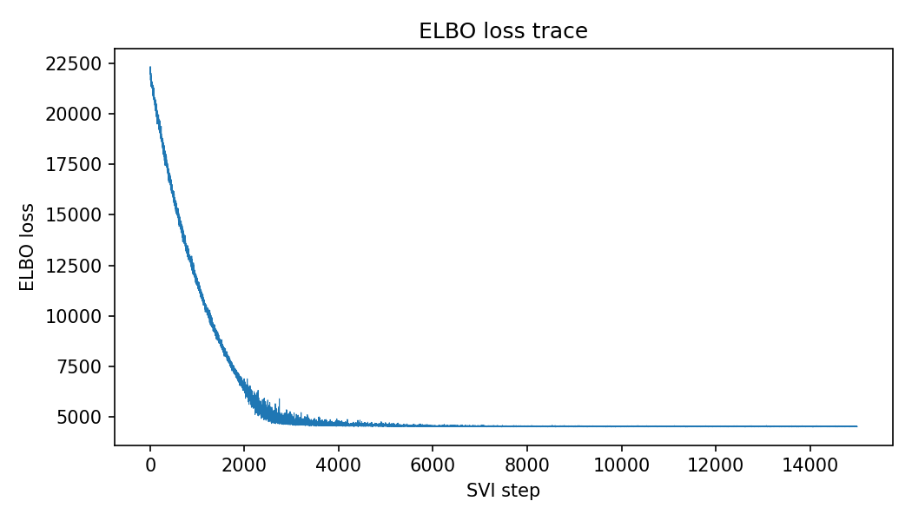

# geneticinfo

Bayesian inference of **genetic information for discrimination** from binary (case/control) traits.

The key quantity being estimated is Λ (lambda) — the expected log-likelihood ratio (in nats) favouring case over non-case status, given an individual's genetic risk (McKeigue, 2019). This gives the maximum expected information for discrimination that could be obtained from a polygenic risk score.  If the class-conditional distribution of the log-likelihood ratio in controls is Gaussian with mean -Λ, the distribution in cases is also Gaussian with mean Λ, and both distributions have variance 2Λ. If the disease is rare (risk < 1%) and Λ is not very large (< 1 natural log unit), Λ = log(λ<sub>S</sub>) where λ<sub>S</sub> is the sibling recurrence risk ratio (Clayton, 2009).   

## Models

All models share the structure: observed binary outcome y is Bernoulli with logits = β₀ + G, where G = L @ Z incorporates genetic correlation via the Cholesky factor L of the genetic relationship matrix.

- **`logistic_mvnorm`** — Gaussian random effects: z ~ Normal(0,1), G = s (L @ z). Default model for SVI fitting.
- **`logistic_mix2_mvnorm`** — Two-component mixture random effects using `MixtureSameFamily`, with the constraint μ = 0.5 s².
- **`lr_discrete`** — Same mixture model with explicit discrete latent class indicators, for use with `DiscreteHMCGibbs`.

## Quick start

### Requirements

- JAX (with GPU support recommended)
- NumPyro
- NumPy, SciPy

A single GPU with 32 GB memory should be able to handle a genetic relationship matrix of size up to 55,000.  

### Running the example

```bash
python run_example.py
```

This simulates a case-control dataset, fits the model by SVI, and prints posterior summaries.

#### Simulated dataset

A population of 320,000 individuals is generated containing full-sib pairs (genetic correlation 0.5), half-sib pairs (correlation 0.25), and unrelated individuals.  Disease status follows a logistic model calibrated to prevalence K = 0.01 with genetic information Λ = 1.0 nat.  The case-control sample retains all cases and an equal number of controls.

```
=== Population ===
  Total individuals:          320,000
    Full-sib pairs:           100,000
    Half-sib pairs:            10,000
    Unrelated:                100,000
  Cases in population:          3,241
  Observed prevalence:   0.010128  (target: 0.0100)
  Concordant-affected full-sib pairs: 26

=== Sibling recurrence risk ratio (λ_S) ===
  Theoretical exp(μ):   2.7183
  Empirical (full sibs): 2.5645
  Ratio empirical/theoretical: 0.9434

=== Case-control sample ===
  Sample size M:           6482
    Cases:                 3241
    Controls:              3241
  Full-sib pairs (both sampled):  65
    of which both affected:       26
  Half-sib pairs (both sampled):  5

=== True parameters ===
  μ       = 1.0000  (expected log-LR, nats)
  s        = 1.4142
  α        = -5.5462  (intercept)
  K        = 0.0100
```

#### Model fitting

`logistic_mvnorm` is fitted via SVI with an `AutoLowRankMultivariateNormal` variational guide (rank 20, 15000 steps, Rényi ELBO with α=0).  Posterior summaries with 94% credible intervals:

```
=== SVI Posterior Summary ===
   Param      mean        sd        3%       97%      true
  --------------------------------------------------
   beta0    0.0050    0.0302   -0.0511    0.0616   -5.5462
       s    1.4701    0.0566    1.3698    1.5773    1.4142
      μ     1.0822    0.0834    0.9382    1.2440    1.0000

ELBO loss: step 1000 = 11626.0, step 15000 = 4519.7
```

Note: the `beta0` estimate differs from the true intercept α because the variational guide operates in unconstrained space; the key parameters of interest are s and μ, which are well recovered.



### Using the module directly

```python
import jax
jax.config.update("jax_enable_x64", True)
import jax.numpy as jnp
from geneticinfo import simulate_casecontrol_related, print_casecontrol_summary, fit_svi_lowrank

# Simulate data
y, A, L, info = simulate_casecontrol_related(K=0.01, mu=1.0)
print_casecontrol_summary(info)

# Fit model
M = info["M"]
result = fit_svi_lowrank(M, jnp.array(L), jnp.array(y, dtype=jnp.float64))

# Posterior samples are in result["s"], result["mu"], result["beta0"]
```

## Files

| File | Description |
|------|-------------|
| `geneticinfo.py` | Model definitions, SVI fitting, and simulation functions |
| `run_example.py` | End-to-end example script |

## References

- Clayton DG (2009). Prediction and interaction in complex disease genetics: experience in type 1 diabetes. *PLoS Genetics*, 5(7), e1000540.
- McKeigue PM (2019). Quantifying performance of a diagnostic test as the expected information for discrimination: relation to the C-statistic. *Statistical Methods in Medical Research*, 28(6), 1841–1851.

## License

See [LICENSE](LICENSE).
